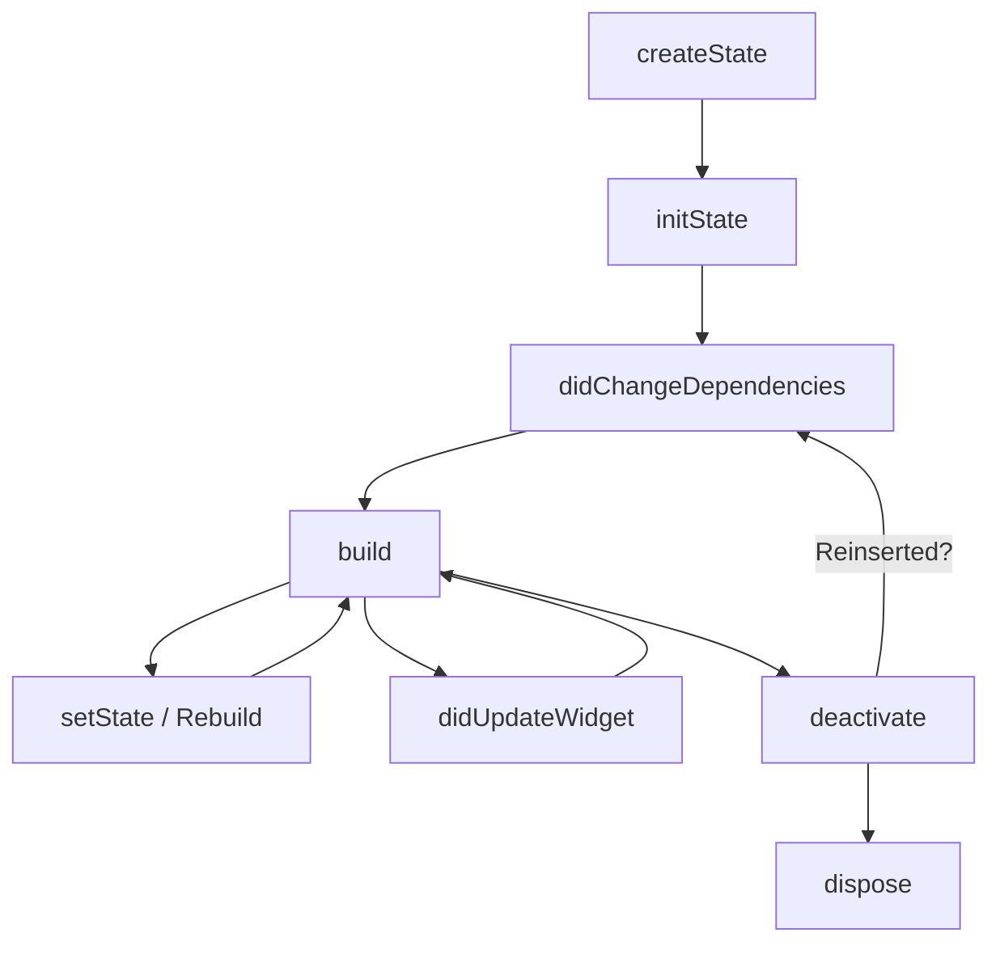
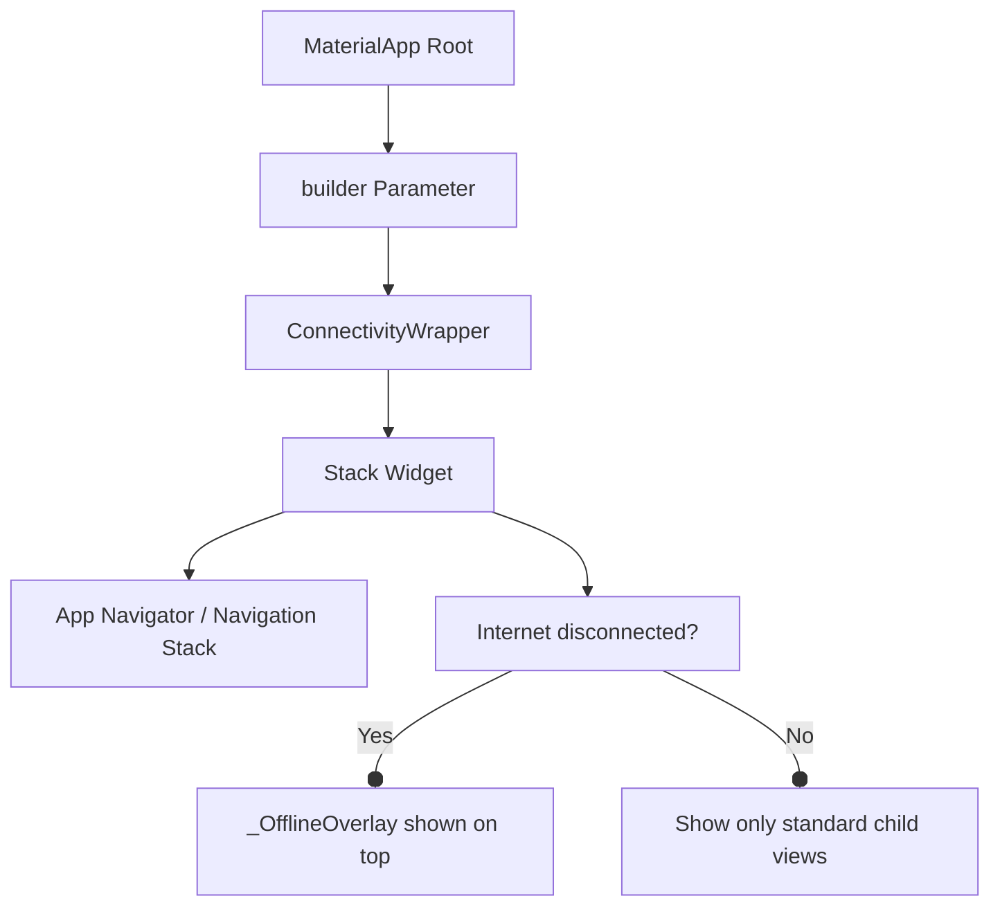

# Interview Preparation & Implementation Explanation Guide

This guide covers core Flutter, Riverpod, Firebase, and architectural concepts implemented in our Expense Tracker application. The explanations use simple English and Hinglish for complex topics.

---

## 1. Flutter Widget Lifecycle (`StatefulWidget`)

### Why & When to use `StatefulWidget`?
* **English**: A `StatefulWidget` is used when the UI needs to change dynamically in response to user actions or local events (like keyboard inputs or animation tick controllers) without depending on global state changes.
* **Hinglish**: Jab hume screen par kisi local interaction (jaise text fields, keypads, ya animations) ke chalte UI ko redraw/update karna ho, tab hum `StatefulWidget` use karte hain.

### Lifecycle Stages & Implementation Reference

Each phase of the lifecycle represents a specific point in a widget's runtime:



1. **`createState()`**:
   * **Concept**: Creates the mutable state object for this widget.
   * **Hinglish**: State class ka instance initialize karta hai jo poore lifecycle ko control karta hai.

2. **`initState()`**:
   * **Concept**: Called exactly once when the state object is inserted into the widget tree. Perfect for one-time initializations.
   * **Hinglish**: Jab widget pehli baar screen par ata hai, tab yeh method **sirf ek baar** chalta hai. Isme hum controllers initialize karte hain ya shared preferences load karte hain.
   * **Implementation Reference**: In [page_passcode_lock.dart](file:///d:/User/Projects/expense-tracker/know_your_transactions/lib/features/transaction/view/page_passcode_lock.dart), we initialize the animation controller and trigger the initial saved PIN loading check:
     ```dart
     @override
     void initState() {
       super.initState();
       _loadPin(); // SharedPreferences se PIN fetch karne ke liye
       _shakeController = AnimationController(
         duration: const Duration(milliseconds: 500),
         vsync: this,
       );
     }
     ```

3. **`didChangeDependencies()`**:
   * **Concept**: Called immediately after `initState` and whenever inherited widgets (like `Theme` or `MediaQuery`) that this widget depends on change.
   * **Theming/Dark Mode Explanation**:
     * **Do we have to use `Theme.of(context)` everywhere to implement dark mode?**
       * **Hinglish**: Haan, aap bilkul sahi hain! Agar hum dynamic theming chahte hain, toh hume screen elements (text, container bg, borders) mein colors ko hardcode (jaise `Colors.white` ya `Colors.black`) nahi karna chahiye. Unhe hume `Theme.of(context).primaryColor` ya `Theme.of(context).cardColor` ke zariye read karna padta hai.
     * **If we fetch colors directly in the `build()` method, why do we need `didChangeDependencies()` at all? (Crucial Interview Question)**:
       * **Hinglish**: Agar aap sirf build method ke andar `Theme.of(context).color` likhte hain, toh aapko manually `didChangeDependencies` override/likhne ki koi zaroorat nahi hai. Flutter internally track karta hai ki build method ne `Theme.of(context)` call kiya hai, aur theme change hone par Flutter automatically `didChangeDependencies()` ko call karke screen ko rebuild kar deta hai.
       * **Aakhir iski zaroorat kab padti hai?**:
         Hume `didChangeDependencies()` ki zaroorat tab padti hai jab hume koi asynchronous check, context-based lookup, ya local state variable key parameters initialization **sirf ek baar** karni ho.
         1. Hum ise `initState()` mein nahi kar sakte kyunki `initState` run hone ke time `context` construct nahi hota aur app crash ho jayegi error ke sath (*dependOnInheritedWidgetOfExactType called before initState completed*).
         2. Hum ise `build()` ke andar bhi nahi kar sakte kyunki `build` bar-bar call hota hai (every scroll, every keyboard tap, every animation frame), toh agar hum wahan init logic likhenge toh vo dynamic value overwrite ho jayegi ya bar-bar recalculate hogi.
       * **Real-life Usecase Example**:
         Agar hume screen loading par ek local data list fetch karni hai jo current API regional language config (`Localizations.of(context)`) par depend karti hai:
         ```dart
         @override
         void didChangeDependencies() {
           super.didChangeDependencies();
           // Runs once when context is ready, and re-runs ONLY if regional language changes
           final language = Localizations.localeOf(context).languageCode;
           _loadLanguageSpecificAssets(language);
         }
         ```

4. **`build()`**:
   * **Concept**: Builds and returns the widget tree to render on screen.
   * **Real-life Project Use Case**: Running UI layouts, rendering custom container shapes, showing icons, buttons etc.
   * **Hinglish**: Build method ko hamesha synchronous aur fast rakhna hota hai. Agar isme high-computational loops ya sync HTTP requests run karenge, toh app screen freeze ho jayegi aur frames drop honge (jank aayega).

5. **`didUpdateWidget(covariant Widget oldWidget)`**:
   * **Concept**: Called when the parent widget rebuilds and passes down new properties/configuration parameters to this widget.
   * **Real-life Project Use Case (Crucial for Interviews)**:
     * **Problem**: When a parent widget rebuilds, the child widget's configuration (class properties) updates, but its mutable `State` class persists in memory. If we cached values inside our state class during `initState`, they will NOT update automatically when parent parameters change!
     * **Solution**: We override `didUpdateWidget` to compare the incoming new parameters against the old parameters and re-initialize state if necessary.
     * **Practical Example**:
       Imagine a detailed transaction history panel that receives a `selectedGroupId` from a parent dropdown selection:
       ```dart
       class GroupTransactionsList extends StatefulWidget {
         final String selectedGroupId;
         const GroupTransactionsList({required this.selectedGroupId});

         @override
         State<GroupTransactionsList> createState() => _GroupTransactionsListState();
       }

       class _GroupTransactionsListState extends State<GroupTransactionsList> {
         late List<Transaction> _cachedTransactions;

         @override
         void initState() {
           super.initState();
           // Loads transactions for the initial group
           _cachedTransactions = Database.fetchGroupTransactions(widget.selectedGroupId);
         }

         @override
         void didUpdateWidget(GroupTransactionsList oldWidget) {
           super.didUpdateWidget(oldWidget);
           // If the parent updates the selected group, initState will NOT run again!
           // We must check if selectedGroupId changed, and reload database data.
           if (widget.selectedGroupId != oldWidget.selectedGroupId) {
             setState(() {
               _cachedTransactions = Database.fetchGroupTransactions(widget.selectedGroupId);
             });
           }
         }
       }
       ```

6. **`setState(VoidCallback fn)`**:
   * **Concept**: Schedules a rebuild of this widget subtree.
   * **Real-life Project Use Case**: Handling local interactive states like a toggle switch (e.g. turning settings options on/off locally), animating items (like PIN shake verification), or managing input fields text loading states.

7. **`deactivate()`**:
   * **Concept**: Called when the state object is removed from the widget tree.
   * **Real-life Project Use Case**: If you use a `GlobalKey` to move a widget from one parent to another Parent in the widget tree (for example, moving a video player widget from a list row view to a full-screen display overlay), Flutter detaches it, triggering `deactivate()`, and immediately attaches it to the new parent without calling `initState` or losing its current video playback progress. If it's not reinserted by the end of the frame, `dispose()` is called.

8. **`dispose()`**:
   * **Concept**: Called when the state object is permanently destroyed. Clean up listeners, timers, stream subscriptions, and controllers here.
   * **Real-life Project Use Case**: In our project, we dispose `_shakeController` in `page_passcode_lock.dart` and `_pulseController` in `widget_connectivity_wrapper.dart` to release hardware memory and prevent memory leaks. If you forget to call `.dispose()` on controllers or stream subscriptions, they remain active in memory, slowly consuming RAM until the OS terminates the app.

9. **`mounted`**:
   * **Concept**: A boolean value telling you if the State object is currently active in the widget tree.
   * **Real-life Project Use Case**: In our project, when checking passcode lock validations, we execute async database checks. If validation completes after the user has closed the screen, calling `setState` or `Navigator.pop(context)` will crash the app because the context is no longer valid. Checking `if (mounted)` ensures safe execution:
     ```dart
     Future<void> _verifyPin(String pin) async {
       final result = await verifyAsync(pin); // Network/Async operation
       if (!mounted) return; // If user pressed back button during wait, exit safely!
       
       if (result == success) {
         Navigator.pushReplacement(context, ...);
       }
     }
     ```

---

## 2. Riverpod Basics & Comparison with Provider

### What is Riverpod?
* **English**: Riverpod is a reactive caching and state-management library for Flutter. It is a complete rewrite of the legacy `Provider` package to make it compile-time safe, testable, and context-independent.
* **Hinglish**: Riverpod ek aisi library hai jo app ka data (state) handle karti hai aur usse reactively refresh karti hai. Isme providers ko global declare kiya jata hai.

### Difference between Provider and Riverpod

| Feature | Legacy Provider | Riverpod |
| :--- | :--- | :--- |
| **Context Dependency** | Depends on `BuildContext`. We need `Provider.of<T>(context)` to read. | Does not depend on `BuildContext`. Uses `WidgetRef ref` which works anywhere. |
| **Safety** | Throws runtime `ProviderNotFoundException` if provider is declared incorrectly. | Checked at **compile-time**. If it compiles, it works! No runtime crashes. |
| **Declaration** | Must be declared inside the widget tree (usually at the root). | Declared globally as `final` constants. |
| **Auto-cleanup** | Requires manual disposal of controllers or custom widgets. | Supports `.autoDispose` to automatically clean memory when unused. |
| **Family Modifier** | Difficult to pass runtime arguments to initialize providers. | Supports `.family` out of the box (e.g. `exportSelectedSpaceProvider(initialSpace)`). |

### If Provider has `Selector`, why choose Riverpod?
* **Hinglish**: **Provider Selector** sirf ek selected data property badalne par rebuild filter karta hai. Lekin Riverpod hume isse behter features deta hai:
  1. **Native Select**: Riverpod mein hum simply `ref.watch(provider.select((s) => s.property))` use kar sakte hain, jo compile-time safe hai.
  2. **Better Architecture**: Riverpod widgets ko `ConsumerWidget` ya `Consumer` mein convert karke local rendering scope define karna bohot asan banata hai, bina parent widget ko stateful banaye.
  3. **Multi-Provider dependency**: Riverpod mein ek provider dusre provider par depend ho sakta hai (using `ref.watch`), jo Provider package mein `ProxyProvider` ke mukable bohot simple aur boilerplate-free hai.

---

## 3. Firebase & Real-time Integration

### What is Firebase?
* **English**: Firebase is a Backend-as-a-Service (BaaS) by Google. It provides hosting, databases, authentication, storage, and push notifications without requiring you to write custom backend servers.
* **Hinglish**: Firebase Google ka ek service suite hai jo backend ka saara kaam (User Auth, Database, Storage) khud sambhal leta hai. Hume alag se Node.js/Python server likhne ki zaroorat nahi padti.

### Realtime Database/Firestore Integration
* **Firestore** real-time dynamic sync provide karta hai. Jab data cloud db par change hota hai, Firestore client (app) automatically stream notifications fetch karta hai.
* **Hinglish**: Hum Firestore ke real-time updates ko listen karne ke liye `snapshots()` API ka use karte hain. Isse jab bhi Firestore db par koi transaction add/edit hoti hai, app bina refresh kiye up-to-date transaction history show karta hai.
* **Implementation Reference**: Inside `view_model_transaction.dart`, our `transactionsStreamProvider` listens to Firestore collections in real time:
  ```dart
  final transactionsStreamProvider = StreamProvider<List<TransactionModel>>((ref) {
    final uid = ref.watch(firebaseAuthProvider).currentUser?.uid ?? '';
    return FirebaseFirestore.instance
        .collection('transactions')
        .where('userId', isEqualTo: uid)
        .orderBy('date', descending: true)
        .snapshots() // Listening in real-time
        .map((snapshot) => snapshot.docs.map((doc) => TransactionModel.fromDoc(doc)).toList());
  });
  ```

---

## 4. StreamProvider vs FutureBuilder

### FutureBuilder
* **Concept**: Used to handle a single asynchronous task that returns a `Future` (a single response, like an HTTP request).
* **Hinglish**: Yeh sirf ek baar (one-shot fetch) data lekar aata hai. Fetch hone ke baad data static rehta hai jab tak page reload na ho.

### StreamProvider
* **Concept**: A Riverpod provider that listens to a stream of events (continuous updates, like WebSockets or Firestore snapshots).
* **Hinglish**: Yeh continuous live feed (chalta hua jharana) hai. Firebase mein jab bhi koi changes honge, yeh provider auto-emit karega aur isko listen kar rahe saare consumers automatic rebuild ho jayenge.

### Why Riverpod `StreamProvider` is better than Flutter's native `StreamBuilder`?
1. **Global Caching**: Native `StreamBuilder` widget tree rebuild hone par stream link bar-bar destroy aur restart karta hai. `StreamProvider` memory mein stream ko safe rakhta hai jab tak user screen change kar raha hai.
2. **State Pattern**: `StreamProvider` state ko `AsyncValue` ke form mein return karta hai, jo standard visual UI patterns handle karne ke liye super clean `.when` builder method deta hai:
   ```dart
   transactionsAsync.when(
     data: (transactions) => buildList(transactions),
     loading: () => CircularProgressIndicator(),
     error: (error, stack) => Text('Error: $error'),
   );
   ```

---

## 5. Internet Detector (Connectivity Wrapper overlay)

### How is it implemented in our project?
* **English**: We intercept internet drops globally by listening to connectivity changes using the `connectivity_plus` package, which is wrapped in a root widget inside `MaterialApp.builder`.
* **Hinglish**: Agar hum internet lost page ko normal screen path (`Navigator.push`) ke zariye navigate karenge, toh current screen ka state aur navigation stack destroy ho sakta hai. Isse bachne ke liye humne global overlay wrapper use kiya hai.

### Implementation Architecture



* **Connectivity Stream**:
  We declared a global stream provider inside [widget_connectivity_wrapper.dart](file:///d:/User/Projects/expense-tracker/know_your_transactions/lib/features/common_widgets/widget_connectivity_wrapper.dart):
  ```dart
  final connectivityStreamProvider = StreamProvider<dynamic>((ref) {
    return Connectivity().onConnectivityChanged;
  });
  ```
* **State Check**:
  We parse the stream events in `isConnectedProvider` to identify active internet connection drops:
  ```dart
  final isConnectedProvider = StateProvider<bool>((ref) {
    final connectivityAsync = ref.watch(connectivityStreamProvider);
    return connectivityAsync.when(
      data: (result) {
        // dynamic check handles both list returns (v6) and single object values (v5)
        List<ConnectivityResult> results = [];
        if (result is List) {
          results = List<ConnectivityResult>.from(result);
        } else if (result is ConnectivityResult) {
          results = [result];
        }
        return results.isNotEmpty && !results.contains(ConnectivityResult.none);
      },
      loading: () => true, // default to connected while loading stream
      error: (_, __) => true,
    );
  });
  ```
* **Globally Enforcing it**:
  In [main.dart](file:///d:/User/Projects/expense-tracker/know_your_transactions/lib/main.dart), we wrapped the MaterialApp's `builder` argument:
  ```dart
  Widget build(BuildContext context) {
    return MaterialApp(
      ...
      home: const SplashPage(),
      builder: (context, child) {
        return ConnectivityWrapper(child: child!);
      },
    );
  }
  ```
  Isse, pure app ke navigational tree (Splash screen, App Lock verification page, Home page, ya profile dashboard) ke upar ye connection overlay humesha dynamic Stack ke zariye available rehta hai, bina page routing ko change kiye.