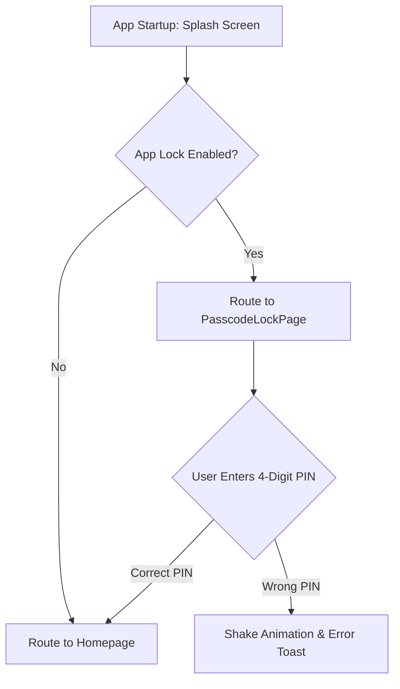

# Implementation Guide: Income Filters & App Lock System

This guide explains how the **Income Filters** and **Passcode App Lock** systems are designed and implemented.

---

## 1. Income Listing & Filters on Homepage

### Key Components
- **State Provider (`homeTransactionTypeFilterProvider`)**:
  - Defined in [view_model_transaction.dart](file:///d:/User/Projects/expense-tracker/know_your_transactions/lib/features/transaction/view_model/view_model_transaction.dart).
  - Holds the active filter state: `'all'`, `'expense'`, or `'income'`.
  
- **Filter Chips UI (`SliverToBoxAdapter`)**:
  - Added in [page_show_all_expenses.dart](file:///d:/User/Projects/expense-tracker/know_your_transactions/lib/features/transaction/view/page_show_all_expenses.dart).
  - Displays three interactive options: **All**, **Expenses**, and **Income**.
  - Highlights the selected chip with animated opacity backgrounds and subtle shadows.

- **Filtering Logic**:
  - Inside the history list builder, transactions are dynamically filtered:
    ```dart
    final displayTransactions = transactions.where((t) {
      if (typeFilter == 'all') return true;
      bool isExpenseForUser = t.isExpense;
      // ... wage adjustments: employee wages are treated as income ...
      return typeFilter == 'expense' ? isExpenseForUser : !isExpenseForUser;
    }).toList();
    ```
  - The badge showing `X total` is also wired to this provider to show the count of matched transactions.

---

## 2. Passcode App Lock System

The Passcode App Lock is built on local settings persistence and custom UI widgets to ensure the app is securely protected.

### Architecture Flow



### Key Components

### A. Persistence Layer (`shared_preferences`)
- Saves App Lock settings locally on the device:
  - `app_lock_enabled` (Boolean): Stores whether security protection is active.
  - `app_lock_pin` (String): Stores the user's 4-digit code.

### B. Startup Security Interceptor (`page_splash.dart`)
- When the splash animations finish, the app checks if `app_lock_enabled` is true:
  ```dart
  final prefs = await SharedPreferences.getInstance();
  final isLockEnabled = prefs.getBool('app_lock_enabled') ?? false;
  final savedPin = prefs.getString('app_lock_pin');
  
  if (isLockEnabled && savedPin != null) {
    // Navigate to PasscodeLockPage instead of going straight to Home
    Navigator.pushReplacement(context, MaterialPageRoute(builder: (_) => PasscodeLockPage(destination: destination)));
  } else {
    Navigator.pushReplacement(context, MaterialPageRoute(builder: (_) => destination));
  }
  ```

### C. Passcode Verification Page (`page_passcode_lock.dart`)
- Designed as a full-screen overlay with a premium gradient background.
- Employs a custom 3x4 numeric keypad (circles with digits `0-9`, backspace, and clear buttons).
- Incorporates a shake animation on the security dots:
  ```dart
  AnimatedBuilder(
    animation: _shakeAnimation,
    builder: (context, child) {
      final dx = sin(_shakeAnimation.value * 2 * pi) * 8; // Custom sin wave shake
      return Transform.translate(offset: Offset(dx, 0), child: child);
    }
  )
  ```

### D. Settings Controls (`page_app_lock_settings.dart`)
- Toggling the switch prompts setting a PIN, then validating it with a "Confirm PIN" screen.
- Disabling the App Lock requires validation of the current PIN to prevent unauthorized modifications.
- Contains a "Change PIN" option.

---

## 3. Offline Internet Connection Lost Screen

This feature prevents data loss and API failures by blocking app interaction with a premium connection-lost screen overlay if the internet goes off.

### Key Components

- **Connectivity Wrapper (`widget_connectivity_wrapper.dart`)**:
  - Encapsulates the entire navigation tree by hooking into `MaterialApp.builder` in [main.dart](file:///d:/User/Projects/expense-tracker/know_your_transactions/lib/main.dart).
  - Listens to `Connectivity().onConnectivityChanged` stream. It supports both list of results (connectivity_plus v6.x) and single results (v5.x) for backward compatibility.
  
- **Dynamic Overlay (`Stack` Injection)**:
  - Inside the wrapper, the app renders a `Stack`. If `isConnected` is false, it puts a full-screen, non-dismissible `_OfflineOverlay` on top of the app widget tree.
  - Since it's a global overlay, it preserves the current page state, user inputs, and screen positions under the hood. As soon as the connection comes back, the overlay is removed, letting the user continue seamlessly.

- **Offline Overlay Screen UI**:
  - Displays a custom pulsing wifi-off icon over a deep green-gray background.
  - Displays a **"Try Again"** button which runs a manual check on the network connectivity state. During checking, the button displays a spinning loading indicator.